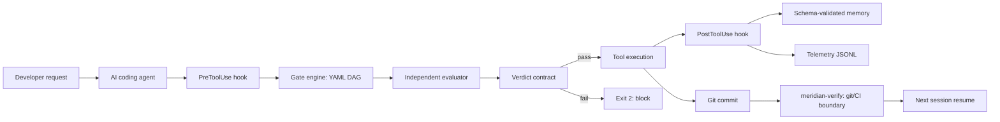

# Meridian Technical Overview

**Status:** v0.1.0 implementation complete; Phases 0–7 complete; Phase 8 community preparation deferred.
**Audience:** engineers, technical recruiters, and teams evaluating AI coding-agent reliability.

## Executive Summary

Meridian is a Bash/Git Bash agent harness for multi-session software projects. It puts durable project intent, mechanically verifiable gates, independent evaluation, persistent memory, and structured telemetry around an AI coding agent.

The central design claim is narrow: prompts can ask an agent to be honest, but a process boundary can require evidence. Meridian therefore turns important progress claims into checks that return machine-readable results. A failing check blocks advancement at the Claude Code tool boundary and blocks commits through the platform-neutral verifier.

Meridian is the source runtime and conceptual spine of a wider family. That does not mean every sibling imports Meridian code. `portfolio-kit` versions shared contracts; some siblings consume those contracts, some re-implement the pattern in another runtime, and others measure or specialize one capability.

## The Problem

Long AI-assisted projects fail in recurring ways:

- The generator evaluates its own work and overestimates completion.
- Context resets lose decisions, assumptions, and stop events.
- Scope and specification drift silently.
- Estimates are not compared with actuals, so errors repeat.
- Markdown status is difficult to validate and query mechanically.

Meridian addresses these as system-design problems. It does not claim to make an agent infallible, and it does not replace human judgment for product scope or release decisions.

## Architecture

The important path is the verdict contract. The agent may request work, but the harness reads gate state, validates prerequisites, invokes or receives an evaluator verdict, and decides whether the operation can proceed.

### Lifecycle

1. **Define intent.** The project records scope and acceptance criteria in `CONTRACT.md` and ordered features in `SPEC.md`.
2. **Compose gates.** `.meridian/gates.yaml` defines a project-specific directed acyclic graph rather than a fixed checklist.
3. **Work within a gate.** The agent implements the current scope and runs the gate engine’s checks.
4. **Evaluate independently.** The evaluator reads the artifacts in a fresh context and writes a structured verdict. It is instructed to find gaps, not to assist the generator.
5. **Enforce.** A failing check, missing verdict, failed score threshold, or invalid state returns exit code 2 at the Claude Code hook boundary. The same contract is checked at commit and CI boundaries on every platform.
6. **Record evidence.** Hooks and scripts append gate transitions, blocks, verdicts, session events, and costs to JSONL telemetry. Memory writes are validated before append.
7. **Resume.** A later session reads the current gate, relevant memory, and prior stop events instead of reconstructing them from conversation context.

## Core Design Choices

| Choice | Alternative considered | Rationale | Consequence |
|---|---|---|---|
| Mechanical exit-code enforcement | Prompt-only instructions | Exit code 2 is controlled by the harness, not by the model’s prose | Hook integration is platform-specific |
| YAML gate DAGs | Fixed checklists | Projects need different ordering, dependencies, and parallel work | DAG validation and cycle detection are required |
| Independent evaluator | Generator self-grading | A fresh context reduces shared assumptions and optimism | Evaluation costs extra tokens and latency |
| Schema-validated JSON/JSONL | Mutable Markdown state | Schemas make memory and verdict data parseable, deduplicable, and checkable | Operators must respect schemas and tooling |
| Progressive disclosure | Load every instruction up front | Small session guidance keeps the agent’s context usable | Important detail lives in skills and referenced docs |
| Git/CI enforcement | Depend on editor integrations | Commit and CI boundaries are available across platforms | Enforcement happens later than a tool-level hook |
| Pattern recipes | One prescribed application stack | Gate patterns transfer across full-stack, CLI, and ML projects | Installation still needs project-specific adaptation |
| Advisory-vs-blocking drift policy | Claim equal enforcement everywhere | Only Claude Code exposes the keystroke-level hook boundary | Generated rules can guide other editors but cannot honestly promise blocking |

## Enforcement Boundaries

**Tier 1, Claude Code:** `PreToolUse` and `PostToolUse` hooks can block the next tool action. A failing contract exits with code 2. This is the strongest Meridian integration.

**Platform-neutral boundary:** `meridian-verify.sh` runs through git pre-commit and CI. It validates the same gate, memory, and evaluator contracts before changes are accepted at those boundaries.

**Advisory integrations:** generated rules for other editors describe the workflow but are not enforcement. Meridian does not publish unmeasured compliance percentages for these tiers.

This split is deliberate: it distinguishes a mechanism Meridian can control from guidance a model or editor may ignore.

## Evidence and Dogfooding

The initial generator/evaluator experiment found a 3.0-point gap: the generator scored its work 5.5/10 while an independent evaluator scored the same work 2.5/10. That experiment motivates separation; it is not a universal benchmark for all models or projects.

Meridian was dogfooded in two production projects:

- **AeroIntel:** retrofit validation exposed the difference between happy-path completion and full lifecycle completion and caught feature staleness.
- **Hard Power Intelligence:** a ground-up build passed a nine-gate DAG, used `meridian-verify` on every commit, and recorded five concrete findings. Its brief-verification gate forced citation evaluation to become infrastructure rather than a post-hoc task.

At the 2026-09-04 documented baseline, Meridian reports 240 passing assertions across 18 suites, all three recipes verified end-to-end, `meridian-doctor` passing GOOD, and shellcheck clean on hooks. The total is the sum of each suite's own reported assertion count. These are project evidence from a single-operator development history, not independent population-level validation.

## Memory, Telemetry, and Calibration

Meridian keeps three distinct memory classes: semantic patterns, episodic events, and corrections for predicted-versus-actual effort. JSONL append operations validate against schemas first. Telemetry records gate transitions, hook blocks, evaluator verdicts, sessions, and costs so an engineer can inspect why a gate failed.

Reflexion entries turn estimates into data: predicted hours, actual hours, root cause, and next action. The goal is calibration over repeated work, not the promise of accurate estimates after one project.

## Family Relationship

- **Meridian:** original runtime primitives, shell harness, hook lifecycle, gate engine, evaluator contract, memory, and telemetry.
- **portfolio-kit:** versioned shared contracts and schemas at 0.1.0. See its [architecture](https://github.com/PCSchmidt/portfolio-kit/blob/main/docs/ARCHITECTURE.md) and [status](https://github.com/PCSchmidt/portfolio-kit/blob/main/docs/STATUS.md).
- **gate-enforced-rag:** consumes portfolio-kit contracts but does not require Meridian runtime or a `.meridian/` directory.
- **dsh-plugin-honesty-gate:** re-implements the contracts inside Cordis/dsh.
- **meridian-jspace:** adds evaluator-rejection interpretability instrumentation.
- **bake-off:** compares runtime approaches and enforcement behavior.
- **living-docs-architect:** applies the reliability pattern to documentation workflows.
- **redteam-blue-gate:** remains a later, sandboxed security experiment.

The family shares terminology and contract lineage. It does not share one universal runtime dependency.

## Limitations and Tradeoffs

Meridian’s shell implementation is intentionally inspectable and portable in Git Bash, but it has fewer abstraction and testing conveniences than a larger service runtime. Claude Code hook enforcement depends on that platform’s hook lifecycle. Generated editor guidance is advisory. Independent evaluation adds latency and cost. Single-operator dogfooding can demonstrate concrete failure modes but cannot establish general effectiveness. Public/unclassified-only operation is a mandatory scope constraint, not an optional deployment setting.

## Recruiter Talking Points

- I treated agent reliability as an enforcement and observability problem, not a prompt-writing problem.
- I separated generation from evaluation so the system can reject work the generating context believes is complete.
- I used a YAML DAG because real projects have dependencies and parallel gates, while preserving mechanical cycle and prerequisite checks.
- I moved cross-platform enforcement to git and CI because editor integrations cannot honestly promise the same blocking semantics.
- I chose schema-validated JSONL for state that must survive sessions and support inspection.
- I dogfooded the framework on a retrofit and a ground-up production project, then converted observed failures into framework changes.
- I can distinguish measured evidence, such as the 3.0-point experiment and recorded dogfood findings, from design goals such as better calibration over time.
- The most important limitation is also explicit: the framework strengthens process boundaries; it does not remove the need for human scope, security, and release judgment.

## Further Reading

- [README.md](README.md) for the concise installation and workflow.
- [MERIDIAN_ARCHITECTURE_DECISIONS.md](MERIDIAN_ARCHITECTURE_DECISIONS.md) for the dated decision record.
- [DEMO_GUIDE.md](DEMO_GUIDE.md) for a six-to-eight-minute technical walkthrough.
- [docs/gate-model.md](docs/gate-model.md) for gate semantics and enforcement details.
- [docs/platform-tiers.md](docs/platform-tiers.md) for platform boundaries.
- [docs/api-reference.md](docs/api-reference.md) for scripts, hooks, skills, and schemas.
